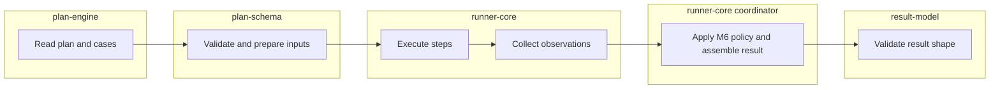

# Lesson 13: Phase integration review

> “How do we know the Phase 1 pieces form one coherent foundation rather than separate demos?” — Iris “Integration Inspector” Ingram, Developer

[← Previous: errors policy](12-errors-policy.md) · [Phase outline](../README.md) · [Next: course skill check →](../quiz.md)

Integration review follows data across boundaries: authored JSON → validation → safe loading → preparation → browser dispatch → observations → result shape. Each hand-off must preserve identity, errors, and documented scope.

The first M7 walkthrough is an executable, synthetic example. `npm run test:phase1-integration` loads a plan file and case with `plan-engine`, passes the loaded case to `runner-core` with a mocked browser, then checks the final in-memory result with `result-model`. It uses public package interfaces, so it reveals a broken hand-off without creating a production dependency between those packages.

```mermaid
flowchart LR
    subgraph E[plan-engine]
        A[Read plan and cases]
    end
    subgraph S[plan-schema]
        V[Validate and prepare inputs]
    end
    subgraph R[runner-core]
        X[Execute steps] --> O[Collect observations]
    end
    subgraph C[runner-core coordinator]
        Z[Apply M6 policy and assemble result]
    end
    subgraph M[result-model]
        Q[Validate result shape]
    end
    A --> V
    V --> X
    O --> Z
    Z --> Q
```

Several pieces remain planned: plan-file-to-coordinator orchestration, CLI protected-value boundaries, result-file writing, and CLI exit behaviour. The walkthrough connects packages only inside a test; it is not a production orchestrator. `executeCase` can use a caller-supplied protected-value map and redact returned soft failures and retained automatic accessibility evidence, without reading `process.env`; a direct scan can redact values its caller supplies. Shared steps now expand and execute at the case-session boundary, but that is not yet full result traceability. A coherent foundation states these gaps plainly.

## Try it

Trace one case through the diagram and name the package responsible at each hand-off.

## You are ready when

- You can explain the complete intended flow and current gaps.
- You can spot a responsibility placed in the wrong package.

[← Previous: errors policy](12-errors-policy.md) · [Phase outline](../README.md) · [Next: course skill check →](../quiz.md)
